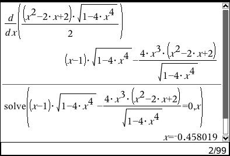

% Aflevering, fredag d. 13. juli 2012
% Kristian Øllegaard

\clearpage

## 1.040
Om en eksponentielt voksende funktion *f(x)* oplyses det at *f(2) = 1* og *f(4) = 9*.

**Bestem forskriften for f(x)**

$$ f(x) = ba^x + c $$

$$ a = \sqrt{\frac{\Delta y}{\Delta x}} $$
$$ a = \sqrt{\frac{9-1}{4-2}} = \sqrt{\frac{8}{2}}  = \sqrt 4 = 2 $$
Resultat:

$$ f(x) = 2^x - 2x -1 $$

Kontrol:

$$ f(2) = 2^2 - 2*2 + 1= 1 $$

$$ f(4) = 2^4 - 2*4 + 1 = 9 $$

## 1.041

Om en eksponentielt voksende funktion f(x) = b*a^x oplyses, at fordoblingskonstanten er 5, og at f(3) = 4,5

Bestem f(8)

**Da fordoblingskonstanten er 5, må f(3+5) være 9.**

## 1.044

Holdbarheden af dybfrosne varer afhænger af temperaturen i fryseren. For en bestemt type pølseer holdbarheden D (målt i døgn) som funktion af temperaturen T (målt i grader celcius) i fryseren givet ved $$ D(T) = 15,71*0,8913^T $$

Beskriv hvilken information funktionen giver om pølsens holdbarhed, og inddrag i beskrivelsen en fortolkning af de konstanter, der indgår i forskriften.

**Svar:**

Parametre:

a = 0,8913

b = 15,71

Ud fra parametret b, kan vi bestemme holdbarheden ved 0 grader. Det betyder at en vil holde sig ca. 16 dage ved 0 grader. Da parametret **a** i funktionen er mindre end 1, ved vi at funktionen er dalende. Det betyder at hvis temperaturen stiger, vil pølsen holde sig forholdsvist kortere og ligeledes vil den holde forholdsvist længere ved en lavere temperatur.

## 1.057

For *t = 1.5* gælder det at *s = 0.24*.

## 1.074

Hvis vi antager at A ville være f'(x), skulle den beskrive en konstant stigende funktion, idet A(x) > 0 i det illustrerede interval. Derimod, hvis vi antager at B er f'(x) viser den en funktion der først stiger hvorefter den falder - det svarer perfekt til A'(x).

## 2.004
$$ \alpha = 27.2^\circ $$
$$ \beta = 37.6^\circ $$
$$ |AB| = 50km $$

$$ b = \frac{sin(B) * a}{sin(A)} $$

$$ b = \frac{sin(142.40) * 50.00 }{sin(27.20)} = 66.74 $$

$$ |DC| = \frac{\sin(A) * b}{\sin(B)} = \frac{\sin(37.6) * 66.74}{\sin(52.40)}  $$

**|DC| = 51.40**

## 3.003

$$ f(x) = b0.9755^x $$

a)
$$ f(x) = 7 * 0.9755^x $$
$$ f(2) = 7 * 0.9755^2 = 6.6612 $$

b)
$$ f(x) = 7 * 0.9755^x $$

c)
$$ 7 * 0.9755^x = 1 $$

$$ x > 78.4479 $$

## 3.004

a) 

Areal af cirkel:
$$ \pi * r^2 $$

Areal af trekant:
$$ \frac{1}{2} * h *g $$

Løsning:

$$ \frac{1}{2} * h *g = \pi * r^2$$

b)

$$ {{\frac{1}{2} * h *g} \over \pi} = r^2$$
$$ r = \sqrt{{\frac{1}{2} * h *g} \over \pi} $$
$$ r = \sqrt{{h *g} \over {2 \pi}} $$

## 3.015

a)

Bestem c:
$$ c^2 = x^2 + x^2 $$
$$ c^2 = 2x^2 $$
$$ c = \sqrt{2x^2} $$

Bestem a og b:
$$ a^2 = b^2 = (1-x)^2 + 1^2 $$
$$ a = b = \sqrt{(1-x)^2 + 1} $$

Bestem C:
$$ \cos(C)= {\frac{a^2+b^2-c^2}{2ab}} $$
$$ \cos(C) = {\frac{2( \sqrt{(1-x)^2 + 1} )^2-(\sqrt{2x^2})^2}{2(\sqrt{(1-x)^2 + 1})^2}} $$
$$ \cos(C)= -2x^2 $$
$$ C = cos^{-1}(-2x^2) $$

Bestem T:
$$ T = \frac{1}{2}ab*\sin(C) $$

$$ f(x) = \frac{1}{2} * ( \sqrt{(1-x)^2 + 1})^2*\sin(cos^{-1}(-2x^2)) $$

b)

## 3.016

a)

$$ f(x) = ax^2+bx+c $$

$$ f(0) = a0^2+b0+4.8 = 4.8 $$

$$ f(x) = ax^2+bx+4.8 $$

$$ f(2.5) = f(-2.5) = 0 $$

$$ f(x) = -0.768x^2+4.8 $$

b)

**Porten kan højst være 3.072 meter høj**

**Porten kan højst være 2.60208 bred**

## 5.004
a)

$$ f(x)=15.7109*0.8913^x $$
$$ R^2=0.9994 $$

b)

$$ f(-18)=15.7109*0.8913^{-18} = 124.673 $$

c)

$$ T_{\frac{1}{2}} = \frac{\ln \frac{1}{2}}{\ln a} = \frac{\ln \frac{1}{2}}{\ln 0.8913 } = 6.02348 $$

Procentvis ændring, når temperaturen øges med 2 grader

$$ 100 - \frac {f(2)}{f(0)} * 100 = 100 -\frac{ 15.7109\*0.8913^{2} }{ 15.7109\*0.8913^{0} } * 100  = 100 - \frac{ 15.7109\*0.8913^{2} } { 15.7109\*1 } * 100 = 100 -79.4416 \% = 20.5584 $$

**Holdbarheden mindskes med 20% per 2. grad**