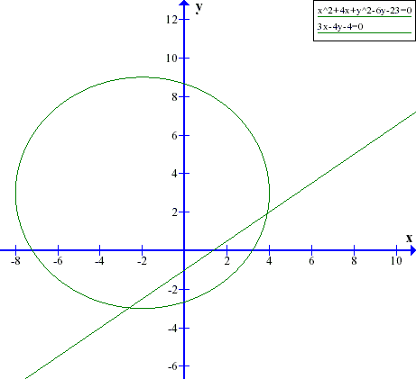

**1.53**

$$ (x-1)^2 + (y-1)^2 = 2^2 $$

**1.55**

# Overskrift 1
## Overskrift 2
### Overskrift 2
#### Overskrift 2
##### Overskrift 2

$$ \frac{ax+bx+c}{\sqrt{a^2+b^2}} $$

$$ \left ( 1 \atop 3 \right ) - \left ( 3 \atop 0 \right ) = \left ( -2 \atop 3 \right ) $$

$$ D = \sqrt{-2^2+3^2} = \sqrt{4 + 9} = \sqrt{13} $$

$$ R = D/2 = 1.8 $$

$$ Centrum = {\left ( 1 \atop 3 \right ) - \left ( 3 \atop 0 \right ) \over 2} = \left ( 2 \atop 1.5 \right ) = (2, 1.5) $$

$$ (x-2) + (y - 1.5)= 1.8^2 $$

**1.56**

$$ C = (4, -1) $$

$$ (x-4)^2 + (y+1)^2 = 3^2 $$

Hvis y=0, krydser vi x-aksen, vi finder nulpunkterne

$$ (x-4)^2 + (0+1)^2 = 3^2 $$

$$ x^2+16-8x + 1 = 9 $$

$$ x^2-8x + 8 = 0 $$

$$ x^2-8x + 8 = 0 $$

$$ x = -b \pm \sqrt{b^2-4ac} \over 2a $$

$$ x = --8 \pm \sqrt{-8^2-4*1*8} \over 2*1 $$

$$ x = {8 \pm \sqrt{32} \over 2} $$

$$ x = 6.82 \lor x = 1.17 $$

**1.57**

$$ x^2 + 8x + y^2 - 4y + 15 = 0 $$

$$ (x-(-4))^2 + (y-2)^2 = 20-15  = 5 $$

$$ Centrum = (-4, 2) $$

$$ R = \sqrt{5} $$

**1.63**

$$ C = (3,3) $$

$$ R = 2 $$

$$ P_0 = (0,2) $$

$$ \vec r = ({3 \atop 2}) $$

$$ y = l = \frac{3}{2}x+2 $$

$$ cirkel = (x-3)^2 + (y-3)^2 = 2^2 $$

$$ cirkel = (x-3)^2 + (y-3)^2 = 4 $$

$$ l = \left ( x \atop y \right ) = \left ( 0 \atop 2 \right ) * t \left ( 3 \atop 2 \right )$$

$$ cirkel = (x-3)^2 + ((0.5x+2)-3)^2 -4 = 0 $$

x=1.0564404225837 or x=4.5435595774163

**2.008**

$$ x^2+4x+y^2-6y-23 =0 $$

$$ (x-(-2))^2+(y-3)^2 = 23 $$

$$ x^2+4+y^2+9 = 36 $$

$$ R = \sqrt{36} = 6 $$

$$ \vec v = \left ( -3 \atop 4 \right ) $$

$$ 3x-4y-4 = 0 $$

$$ 3x-4 = 4y $$

$$ \frac{3x-4}{4} = y $$

$$ \frac{3}{4}x-1 = y $$

$$ distance(P, l) = \frac{ax+by+c}{\sqrt{a^2+b^2}} $$

$$ distance(P, l) = \frac{3*(-2)-4*(3)-4}{\sqrt{3^2-4^2}} $$

**b)**

$$ distance(P, l) = \frac{3*(-2)-4*(3)+c}{\sqrt{3^2-4^2}} = \pm r $$

$$ c = 48 \lor c = -12 $$
