# Onsdag d. 11. juni

1. Definition af differentialkvotient
2. Regneregler
	1. Produktreglen
3. Opgaver
	1. 1045 -> 1055 (uden hjælpemidler)
	2. 1048 - Bestem tangentligningen (uden hjælpemidler)
	3. 6001, 6002, 6004, 6006

## 6.002
$$ O(x) = (13/3) \pi x^2 + {40 \over x} $$

$$ O(2) = (13/3) \pi 2^2 + {40 \over 2} $$

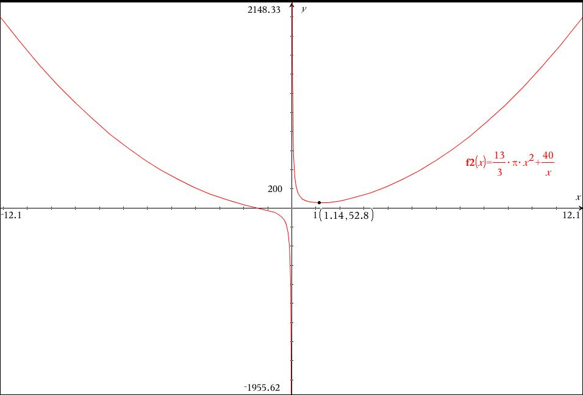

## 6.003

$$ O(x) = x^3 - 30x + 500x + 30 $$

$$ F(x) = 308\*x-(x^3-30\*x^2+500\*x+30) $$

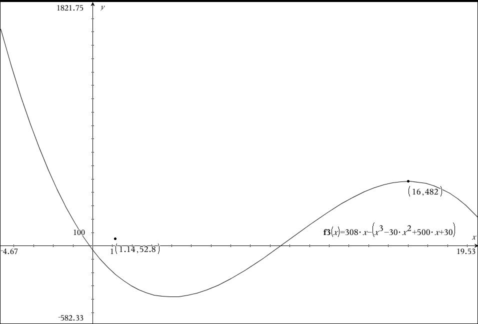

## 6.004

Iltunderskudet er størst efter 2,56 dage

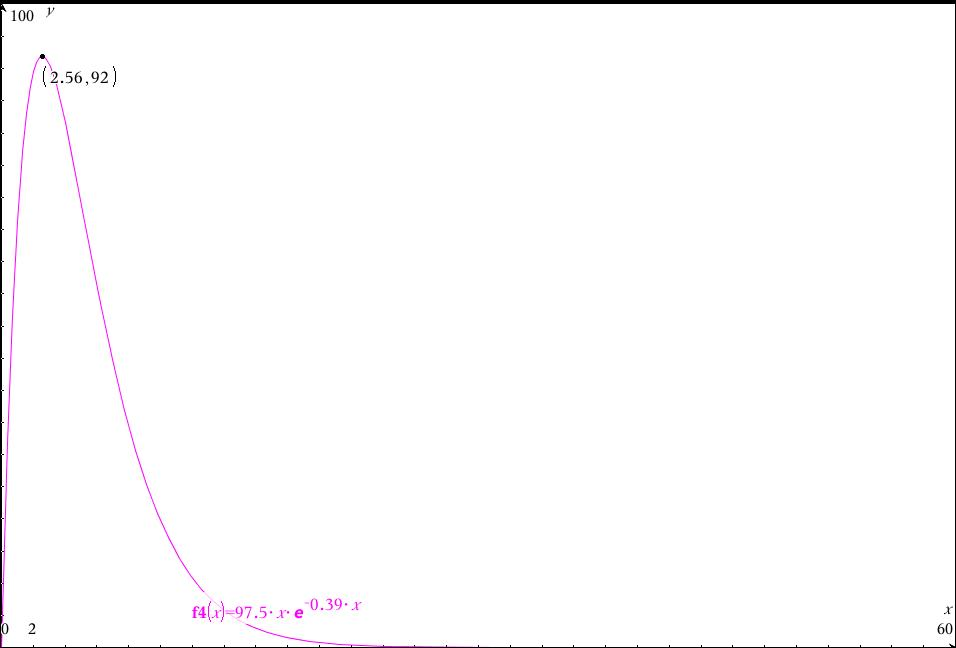

## 6.006

a) $$ O(x, h) = 3\*2\*x^2 + 2\*4\*h\*x $$

b)

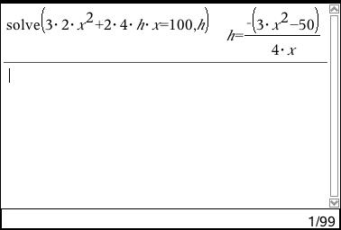

$$ V(x) = x^2 {({-(3x^2-50)} \over 4x} $$

c) 
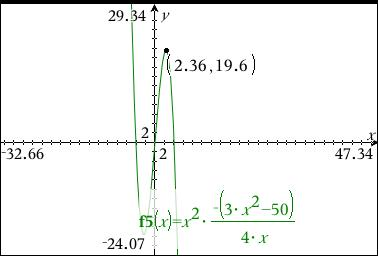

# Torsdag d. 12 juli

Opgaver:

1062. 
1063. 
1064. 
1065. 
1067. 

## Opgaver:

### 7001
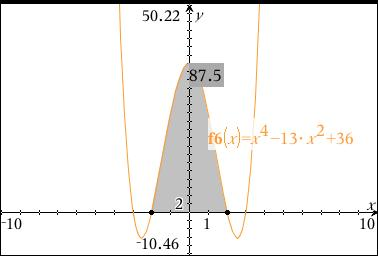
### 7003
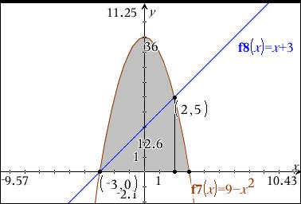
36 - 12.6
### 7004
 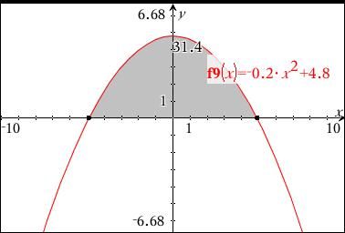
### 7007
 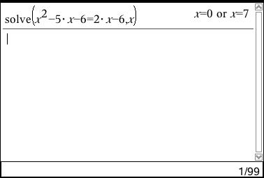
 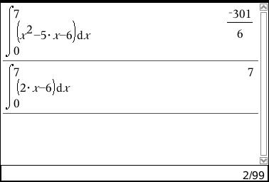
$$ A = 7 -- {-301 \over 6} = 7 + {301 \over 6} $$
### 9013

a)

 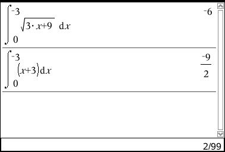

b)

 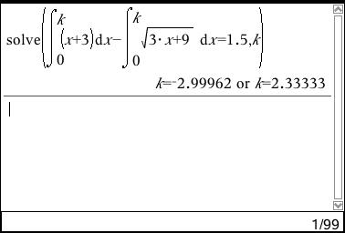

# Fredag d. 13. juli 2012

### 9.116

### 9.084
$$ f(x) = 80\*x-10\*x^{2} $$

$$ \int^4_0 ( 80\*x-10\*x^{2})^2 \space dx  = \frac{1280}{3} $$

$$ V(x) = \pi ( \frac{1280}{3} )^2 = \frac{163840*\pi}{3} =171572.84678805 $$

$$ V_k(x) = \frac{1}{2} V = \frac{1}{2} \frac{163840*\pi}{3} $$

$$ \pi * \int^k_4 80x-10 \* x^{2})^{2} dx = \frac{1}{2} \frac{163840*\pi}{3} $$

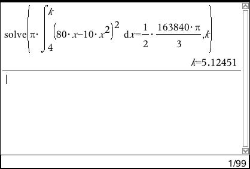

**k=5.12451**

### 9.081

$$ f(x) = e^{-x^2+2x+1} $$

$$ f'(x) = e^{-x^2+2x+1} * -2x + 2 $$

$$ f'(x) = 0 $$

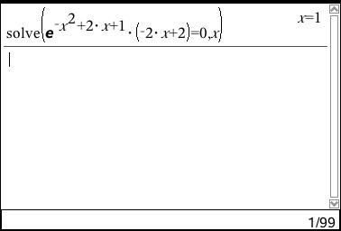

### 9.064

$$ f(x) = \frac{1}{x} x^{\frac{1}{2}} $$
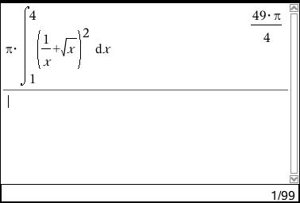

### 9.047

$$ f(x) = x^2 -10x +30 $$

a)
$$ A_1 = \int^{10}_0 x^2-10x+30 $$

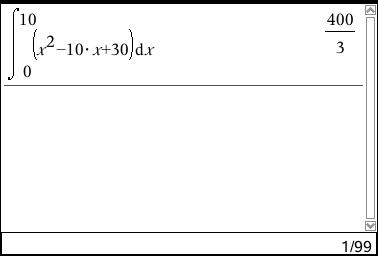

b)

$$ A_2 = \pi \int^{10}_0 (x^2-10x+30)^2  $$

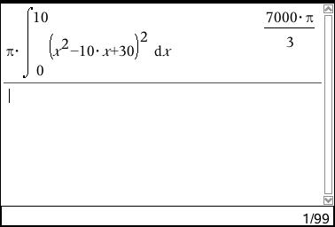