# Onsdag d. 11. juni

1. Definition af differentialkvotient
2. Regneregler
	1. Produktreglen
3. Opgaver
	1. 1045 -> 1055 (uden hjælpemidler)
	2. 1048 - Bestem tangentligningen (uden hjælpemidler)
	3. 6001, 6002, 6004, 6006

## 6.002
$$ O(x) = (13/3) \pi x^2 + {40 \over x} $$

$$ O(2) = (13/3) \pi 2^2 + {40 \over 2} $$

## 6.003

$$ O(x) = x^3 - 30x + 500x + 30 $$

$$ F(x) = 308\*x-(x^3-30\*x^2+500\*x+30) $$

## 6.004

Iltunderskudet er størst efter 2,56 dage

## 6.006

a) $$ O(x, h) = 3\*2\*x^2 + 2\*4\*h\*x $$

b)

$$ V(x) = x^2 {({-(3x^2-50)} \over 4x} $$

c) 

# Torsdag d. 12 juli

Opgaver:

1062. 
1063. 
1064. 
1065. 
1067. 

## Opgaver:

### 7001

### 7003

36 - 12.6
### 7004
 
### 7007
 
 
$$ A = 7 -- {-301 \over 6} = 7 + {301 \over 6} $$
### 9013

a)

 

b)

 

# Fredag d. 13. juli 2012

### 9.116

### 9.084
$$ f(x) = 80\*x-10\*x^{2} $$

$$ \int^4_0 ( 80\*x-10\*x^{2})^2 \space dx  = \frac{1280}{3} $$

$$ V(x) = \pi ( \frac{1280}{3} )^2 = \frac{163840*\pi}{3} =171572.84678805 $$

$$ V_k(x) = \frac{1}{2} V = \frac{1}{2} \frac{163840*\pi}{3} $$

$$ \pi * \int^k_4 80x-10 \* x^{2})^{2} dx = \frac{1}{2} \frac{163840*\pi}{3} $$

**k=5.12451**

### 9.081

$$ f(x) = e^{-x^2+2x+1} $$

$$ f'(x) = e^{-x^2+2x+1} * -2x + 2 $$

$$ f'(x) = 0 $$

### 9.064

$$ f(x) = \frac{1}{x} x^{\frac{1}{2}} $$

### 9.047

$$ f(x) = x^2 -10x +30 $$

a)
$$ A_1 = \int^{10}_0 x^2-10x+30 $$

b)

$$ A_2 = \pi \int^{10}_0 (x^2-10x+30)^2  $$

# Mandag d. 16. Juli 2012

### 1.076

$$ \frac{dy}{dx}-3y = -3x^3-x+1 $$
$$ \frac{dy}{dx} = -3x^3-x+1+3y $$
$$ \frac{dy}{dx} = -3x^3-x+1+3(x^3+x^2+x) $$
$$ \frac{dy}{dx} = 3x^2+2x+1 $$
$$ f'(x) = 3x^2+2x+1 $$
$$ (x^3+x^2+x)' = 3x^2+2x+1 $$
$$ 3x^2+2x+1 = 3x^2+2x+1 $$

### 1.077
Monotoniforhold 

y' = 0 for x = -1

$$ + \space 0 + $$

$$ \downarrow - \uparrow $$
### 9.139

$$ y' = \frac{y}{x}+1 $$

$$ (x \ln x)' = \frac{y}{x}+1 $$

$$ (x \ln x)' = \frac{x \ln x}{x}+1 $$

$$ (x \ln x)' = \ln x + 1 $$

$$ \ln x + 1 = \ln x + 1 $$

### 9.123

$$ f(x) = x^4 + \ln(2x+1) $$

$$ f'(x) = 4x^3 + \frac{1}{2x+1} * 2 $$

$$ f'(x) = 4x^3 + \frac{2}{2x+1} $$

$$ f'(1) = 4\*1^3 + \frac{2}{2\*1+1} $$

$$ f'(1) = 4 \frac{2}{3} $$

### 9.124

$$ \frac{dy}{dx} = \frac{x^3+1}{y} $$

$$ f'(x) = \frac{x^3+1}{y} $$

$$ f'(2) = \frac{8+1}{4} $$
$$ f'(2) = \frac{9}{4} $$

$$ T(x) = \frac{9}{4}x + k $$

$$ T(2) = \frac{9}{4}2 + k  = 4 $$

$$ k = -\frac{1}{2}$$

$$ T(x) = \frac{9}{4}x - \frac{1}{2} $$

### 9.125

$$ \int 2x(x^2+1)^5 dx $$

$$ \int 2x(x^2+1)^5 dx $$

$$ f(x) = \int 2x(x^2+1)^5 dx $$

$$ F(x) = \frac{ (x^2+1)^6 }{6} $$

### 9.108

$$ (xe^x+3x)' = xe^x+3x+\frac{xe^x+3x}{x}-3x $$

$$ (xe^x+3x)' = \frac{ x(xe^x) }{x}+\frac{xe^x+3x}{x} $$
$$ (xe^x+3x)' = \frac{ x(xe^x) + xe^x+3x}{x} $$
$$ (xe^x+3x)' = \frac{ x^2 + 2xe^x +3x}{x} $$

$$ e^x + xe^x + 3 = \frac{ x^2 + 2xe^x +3x}{x} $$

$$ e^x + xe^x + 3 = \frac{ x(x + 2e^x +3)}{x} $$
$$ e^x + xe^x + 3 = x + 2xe^x +3 $$

Regnefejl.

### 9.103

s = sekunder

$$ f'(s) = 0.4s - 0.001*f(s)$$

# Tirsdag d. 17. Juli 2012

### 8.001

$$ \frac{dy}{dx} = f'(x) = \frac{x+2}{y} $$

$$ \frac{2+2}{-2} =  \frac{4}{-2} = -2 $$

$$ t(x) = f'(x)x - f(x_0) $$

$$ t_1(x) = -2x + 2 $$

### 8.002

$$ y'(x) = -2x*y $$

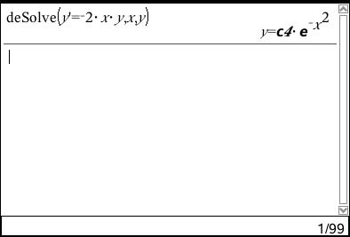

$$ c*e^{-1^2} = e $$

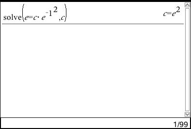

$$ f(x) = e^2*e^{-x^2} = e^{2-x^2} $$

Hældningen i hhv. -1 og 1

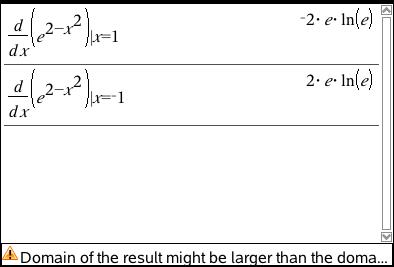

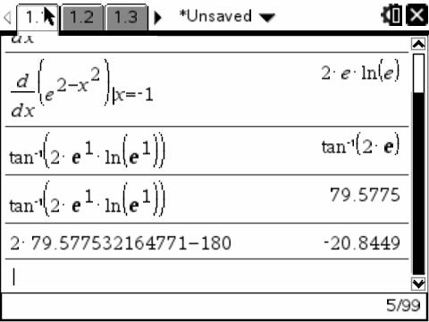

### 8.003

$$ y' = 5y $$

derfor

$$ y = k*e^{5x} $$

$$ y(0) = k\*e^{5\*0} = 4 $$

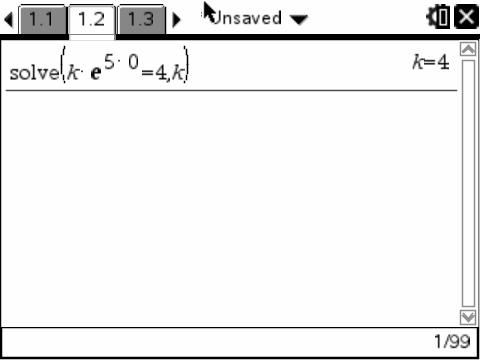

$$ y = 4*e^{5x} $$

### 8.004

$$ y' + 3y = 20 $$

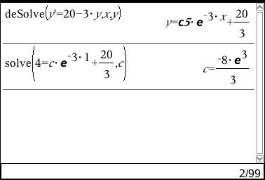

$$ y = (\frac{-8*e^3}{3})e^{-3x}+\frac{20}{3} $$

### 8.005

$$ y' + y = 20x + 3 $$

$$ y' = 20x + 3 - y $$

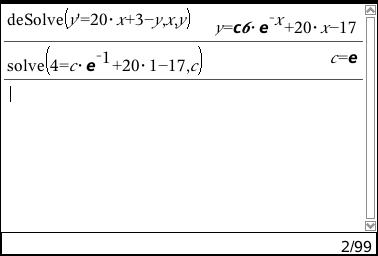

$$ y = e * e^{-x}+20*x-17 $$

### 8.006

$$ y' = 2x +5 - y $$

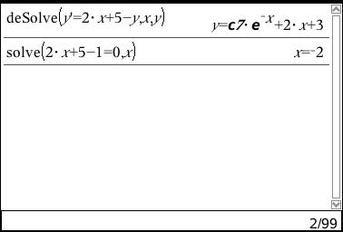

Vi ved nu at x=-2 og y=1 (fra tangenten), vi kan derfor løse f(x)

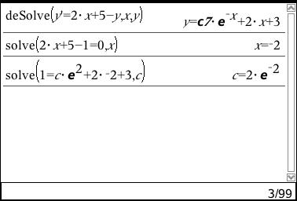

$$ f(x) = (2*e^{-1}) * e^x + 2 * x + 3 $$

### 8.007

$$ y' -3y = e^x $$

$$ y' = e^x + 3y $$

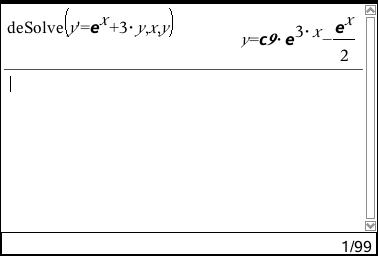

f(1) = 1, da vi kender hældningen af den anden

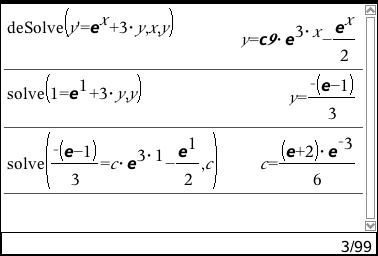

Resultat:

$$ y = \frac{(e+2)\*e^{-3}}{6}\*e^{3x}-\frac{e^x}{2} $$

### 8.008

$$ V(x) = \sqrt x, x \geq 0 $$

a)

$$ f(x) = \pi \int_0^{h} x \space dx$$

### 8.011

### 9.151

### 9.132

### 8.009

# Onsdag d. 18. juli 2012

### 9.079

### 9.085

### 9.100

### 9.108

### 9.118

# Torsdag d. 19. juli 2012

## Matematik bog

### 1.37

**a)**

$$ A = (2,2) \space B = (-1, 3) $$

$$ \vec{AB} = \left ( -1 - 2 \atop 3 -2 \right ) = \left( -3 \atop 1 \right ) $$

$$ \vec M = \hat{\vec{AB}} = \left( -1 \atop -3 \right ) $$

$$ \left( -1 \atop -3 \right ) * \left( x-2 \atop y-2 \right ) = -1(x-2) - 3(y-2) = 0 $$

$$ -1x + 2 - 3y + 6 = 0 $$

$$ -1x - 3y + 8 = 0 $$

**b)**

$$ C = (1, -2) \space D=(7,-2) $$

$$ \vec{CD} = \left ( 7 - 1 \atop -2 - (-2) \right ) = \left ( 6 \atop 0 \right )$$

$$ \vec M = \left ( 0 \atop 6 \right ) $$

$$ \left( 0 \atop 6 \right ) * \left( x-(-2) \atop y-(-2) \right ) = 6(y + 2) = 6y + 12 = 0 $$

**c)**

$$ E = (2,8) \space F (3, -5) $$

$$ \vec{EF} = \left ( 3 - 2 \atop -5 -8 \right ) = \left ( 1 \atop -13 \right ) $$

$$ \vec M = \left ( 13 \atop 1 \right ) $$

$$ \left ( 13 \atop 1 \right ) * \left ( x - 2 \atop y - 8 \right ) =  13(x-2) + 1(y-8) = 13x - 26 + y - 8 = 13x + y - 34 = 0 $$

### 1.39

**a)**

$$ 4x-3y+12 = 0 $$

$$ ax + by + c = 0 $$

$$ \vec n =  \left ( 4 \atop -3 \right ) $$

test: x=3

$$ 4*3 - 3y + 12 = 0 $$

$$ 12 - 3y + 12 = 0 $$

$$ 24-3y = 0 $$

$$ y = 8 $$

$$ (x_0,y_0) = (3, 8) $$

$$ (x_1,y_1) = (2, 20/3) $$

**b)**

$$ 5x - 3y + 12 = 0 $$

**c)**