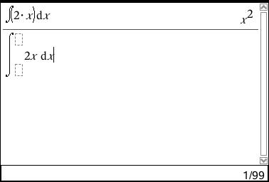
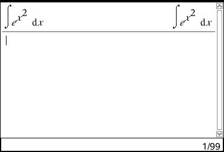
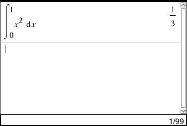
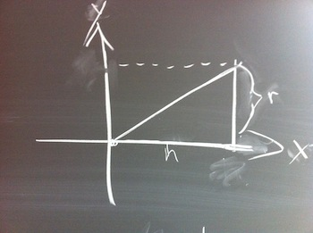

% Integralregning
% Kristian Øllegaard
% 12-07-2012

# Integralregning

Består af stamfunktioner, summer og sandsynlighedsregning.

## Stamfunktioner

En stamfunktion er at gå baglæns ifht. differentiering.

$$ f(x) = 2x $$

**Stamfunktion til f = F**

$$ F'(x) = f(x) $$

$$ F(x) = x^2 + k $$

Idet man kan tilføje en hvilkensomhelst konstant til en given stamfunktion, er det ikke kun een stamfunktion, men uendeligt mange.

$$ g(x) = x^3 $$

$$ G(x) = {1 \over 4}x^4 + k $$

+-----------------+-------------------------------+
| f(x)            | F(x)                          |
+=================+===============================+
| $$x^7$$         | $$1/8x^8 + k$$                |
+-----------------+-------------------------------+
| $$5x^{10}$$     | $${5 \over 11}x^{11} + k $$   |
+-----------------+-------------------------------+
| $$3x^2+2x-8$$   | $$ x^3 + x^2 -8x +k$$         |
+-----------------+-------------------------------+
| $$1/x$$         | $$ lnx + k $$                 |
+-----------------+-------------------------------+
| $$e^x$$         | $$ e^x + k $$                 |
+-----------------+-------------------------------+
| $$e^(5x)$$      | $$ {1 \over 5}e^{5x} + k $$   |
+-----------------+-------------------------------+
| $$3^x$$         | $$ {1 \over ln3} * 3^x + k $$ |
+-----------------+-------------------------------+
| $$-(1/x^2)$$    | $$ {1 \over x} + k $$         |
+-----------------+-------------------------------+
        

Eksempel: 
$$ f(x) = 2x $$
$$ F(x)  = \int 2x \space dx = x^2 + k $$

$$ (\int{f(x) \space dx})' = f(x) $$

$$ \int{f(x) + g(x)}dx = \int{f(x)dx} + \int{g(x)dx} $$

$$ \int{k * g(x)}dx = k * \int{g(x)dx} $$

### Definition

$$ \int x^a \space dx = {1 \over {a+1}}x^{a+1}+k $$
eller
$$ \int a^x dx = {1 \over lna}a^x+k = {a^x \over lna} +k $$

### Brug af lommeregner

### e^x^2
Kan ikke udtrykkes, derfor skriver lommeregneren flg.:

### Udregning af konstant
Ved et givet punkt (2,8)
$$ f(x) = 2x $$
$$ F(x) = x^2+k $$
$$ 8 = 2^2 + k $$
$$ k = 4 $$
$$ F(x) = x^2+4 $$

Husk at sørge for 'k' bliver husket i hvert led.

### Om flere stamfunktioner til en given funktion

$$ f(x) $$
$$ F(x)' = f(x) $$
$$ G(x)' = f(x) $$

$$ F(x)-G(x) = k $$
$$ F(x) = G(x) + k $$

Bevis:

$$ ({F(x)-G(x)})' = F'(x) - G'(x) = f(x)-f(x) = 0 $$
Derfor 
$$ F(x) - G(x) = k $$

### Tid/distance

t = tid

s = strækning

v = hastighed

a = acceleration

$$ s'(t) = v = 3 $$
$$ f'(x) = 3 $$
$$ f(x) = 3x + k $$
$$ s(t) = 3t + k $$

$$ s(t) $$
$$ s'(t) = v(t) $$
$$ v'(t) = a(t) $$

### Areal af f= stamfunktionen til f

$$ A(b) = F(b) - F(a) = \int^b_a f(x) dx = [F(x)]^b_a=F(b)-F(A) $$ 

Eks.
Areal af f(x) = x^2 i intervallet [0;1]
$$ \int^1_0 x^2 \space dx = [{1 \over 3}x^3] = {1 \over 3}\*1^3-{1 \over 3}\*0^3={1 \over 3} $$

Eks. på ti-nspire

### Areal/Oversum/Undersum

#### Oversum
$$ O(x) = f(x_1) \Delta x + f(x_2) \Delta x … f(x_n) \Delta x  = \sum_{i=1}^5  \space f(x_i) \Delta x $$

#### Undersum
$$ U(x) = $$

#### Middelsum

$$ M(x) = $$

#### Areal

$$ U(x) \leq A \leq O(x) $$

$$ O-U \to_{\Delta x \to 0} 0 $$

$$ areal = f(b)-f(a) \Delta x $$

$$ \sum^\infty\_{i=1} f(t_i) \Delta x \to\_{x \to 0} \int^b\_a f(x) \space dx $$

#### Bestemmelse af arealet for en kegle

$$ a= \frac{\Delta x}{\Delta y} $$

$$ y = \frac{r}{h}x $$

$$ \int^h_0 \pi (\frac{r}{h}x)^2 dx = \pi \frac{r^2}{h^2} \int^h_0 x^2 dx = \left[\frac{1}{3}x^3\right]^h_0 * \pi \frac{r^2}{h^2} = \frac{1}{3} \pi \frac{r^2}{h^2} + 0 = \frac{1}{3}h \pi * r^2 $$
