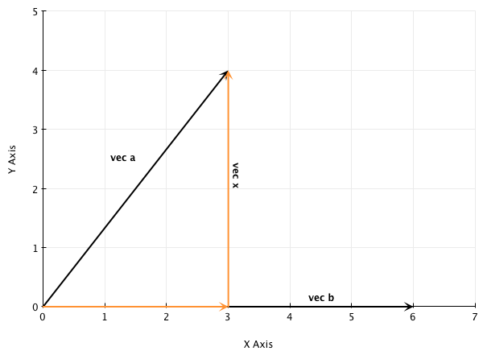

# Vektorregning

## Definition af en vektor (2d)

Bestemt retning og længde, men placeringen i koordinatsystemet er ikke bestemt.

$$ \overrightarrow{a} = \bar{a} = \mathbf{a} $$

$$ \overrightarrow{a} = \begin{array}{c} n \\ r \end{array}$$

$$ P(p_1, p_2) \land Q(q_1, q_2) $$

$$ \overrightarrow{PQ} = \left ( q_1 - p_1 \atop q_2 - p_2 \right ) $$

$$ parallel = \parallel $$

**Ortogonale = vinkelret**

$$ \overrightarrow{a} \perp \overrightarrow{b} $$

$$ \overrightarrow{a} \perp \overrightarrow{b} <=> \overrightarrow{a} * \overrightarrow{b} = 0 $$

**Længden af en vektor**

$$ |\overrightarrow{a}| = \sqrt{(a_1)^2 + (a_2)^2}$$

**Hastighed/fart**

$$ Hastighed = \overrightarrow{v} = \left ( 3 m/s \atop 4 m/s \right ) $$

## Regning med vektorer

### Plus
$$ \overrightarrow{a} + \overrightarrow{b} = \left ( a_1 + b_1 \atop a_2 + b_2 \right ) $$

$$ \overrightarrow{a} + \overrightarrow{b} + \overrightarrow{c} = \left ( a_1 + b_1 + c_1 \atop a_2 + b_2 + c_2 \right )  $$

### Minus

$$ \overrightarrow{a} - \overrightarrow{b} = \left ( a_1 - b_1 \atop a_2 - b_2 \right ) $$

### Produkt

$$ \vec a * k = \left ( a_1 * k \atop a_2 * k \right ) $$

### Produkt (skalarprodukt)

Et tal kan ganges ind, som normalt og ovenstående - men hvis det er en anden vektor:

$$ \vec{a} * \vec{b} = \left ( a_1 \atop a_2 \right ) * \left ( b_1 \atop b_2 \right ) = a_1*b_1 + a_2 * b_2 = |\vec{a}| * |\vec{b}| * \cos v $$

Obs. Resultatet bliver ikke til et nyt vektor, men et tal

Hvis skalarproduktet er > 0, er vektorernes vinkel spids. Hvis skalarproduktet = 0 er den 90 grader (ret) og hvis skalarproduktet < 0 er dem stum.

### Divion med tal

Man dividerer begge punkter

### Divion med andre vektorer

**Kan ikke lade sig gøre!**

## Ensrettede vektorer

$$ \vec{a} = \left ( 2 \atop 3 \right ) $$

$$ \vec{b} = \left ( 8 \atop 12 \right  ) = 4 \vec a $$

$$ \vec a * \vec b = 16 + 36 = 52 = \sqrt{13} * \sqrt{208} * \cos V = \sqrt{13*208} * \cos V  = 52 * \cos V $$

$$ \cos V = 1 $$

$$ V = 0 $$

## "Hat-vektor"/tværvektor og omløbsretning (2d)

$$ \hat{\vec a} = \left ( -a_2 \atop a_1 \right ) $$

Positiv omløbsretning = $\nwarrow$ +

Negativ omløbsretning = $\swarrow$ -

Drejer vektor $90^\circ$ i positiv omløbsretning.

Eksempel:

$$ \vec a = \left ( 2 \atop 8 \right ) \space \hat{\vec a} = \left ( -8 \atop 2 \right ) $$

### Determinanten

$$ Det(\vec a, \vec b) = \hat{\vec a} * \vec b = \left ( -a_2 \atop a_1 \right ) * \left ( b_1 \atop b_2 \right ) = a_1 * b_2 - a_2 * b_1 = \left | a_1 \space b_1 \atop a_2 \space b_2 \right | $$

Således kan arealet bestemmes:

$$ areal = \left | Det(\vec a, \vec b) \right | =  | \left | a_1 \space b_1 \atop a_2 \space b_2 \right | |$$

**Eksempel/Obs.:**

$$ \vec a = \left ( t-1 \atop 2 \right ), \vec b \left ( 3 \atop t \right ) $$

$$ areal(\vec a, \vec b) = 8 $$

$$ \left | t-1 \space 3 \atop 2 \space t \right | = t^2-t-6 = \pm 8 $$

$$ t^2-t-6 = 8 $$

$$ t^2-t-6 = -8 $$

### Projektion

Hvor bred er $\vec a$ ifht. $\vec b$

$$ \vec a_{\vec b} = s*\vec b $$

$$ \vec a = s*\vec b + \vec x $$

$$ \vec a * \vec b = s * \vec b * \vec b + \vec x * \vec b = s (|\vec b|)^2$$

$$ \frac{\vec a * \vec b}{|\vec b|^2} = s$$

$$ \vec a = s*\vec b + \vec x  = \frac{\vec a * \vec b}{|\vec b|^2} * b $$

#### Enhedsvektor

Angiver 1 "unit" i et koordinatsystem

$$ \vec a_{\vec b} = \frac{\vec a * \vec b}{|\vec b|*|\vec b|} = \frac{\vec a * \vec b}{|\vec b|} * \frac{\vec b}{|\vec b| } $$

$$ \vec e = \frac{\vec b}{|\vec b| } $$

## Distance

$$ distance(P, l) = \frac{ax+by+c}{\sqrt{a^2+b^2}} $$

### Parameterfremstilling rette linjer

